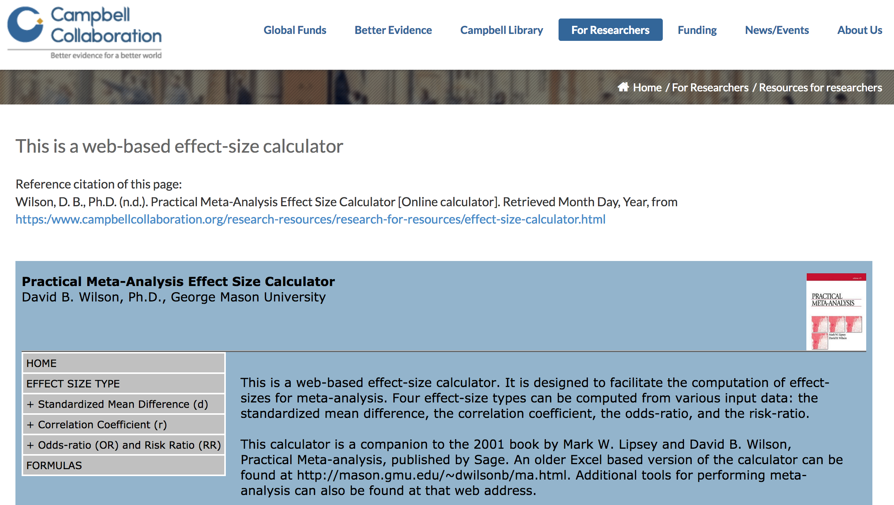

```{r setup, cache = F, echo=FALSE, results = FALSE}
knitr::opts_chunk$set(error = TRUE) #allow some execution errors for demonstration purposes
knitr::opts_chunk$set(eval = TRUE, echo = TRUE, warning = FALSE)
sessionInfo()
```


# EXERCISE - DATA EXTRACTION AND ORGANISATION 

Prepared by Malgorzata (Losia) Lagisz, BEES, UNSW, AU, losialagisz@gmail.com.   

**Setup:** Work in pairs or small groups. R/Rstudio and Internet connection needed.   

### Purpose of the exercise:   
In this exercise you get some practice and tips on:   
 * Organising your data set  
 * Extracting and coding   
 * Converting different types of information   
 * Documentation and reporting   

  
<br>
## Introduction   

Imagine, you quickly got well and decided to carry on the Terminal Investment Meta-analysis Project.   
After a few weeks you finished searching and screening literature for the relevant papers. You now have a collection of around 30 included full-text papers (relatively manageable; some projects have 300 or more), stored neatly as pdf files and supplementary information, in whatever format available. It is time to start extracting the data (ideally, you should have planned this in detail while writing up your protocol/preregistration, but in this exercise we assume you did not).   


<br>
********************************************************************************   

###  Organising your data set   

Before you extract actual data for the meta-analysis you need some sort of system to manage data extractions and store the data (we assume by now you already have a system for organising and storing your references and papers, so we don't cover this). For data extractions, many people just stick to Excel spreadsheets, or any other spreadsheets or extraction forms that can be converted into spreadsheets (e.g. Google Forms). Some researchers even build elaborated relational databases (which recoup the high initial investment cost with many benefits later on). Whatever you chose, you need a platform where you can freely add and edit columns and be able to store different types of data, so rigid systems purpose-built for medical trial data are not recommended. In this exercise we will stick to the simplest, but flexible platform - an Excel spreadsheet.    

**QUESTION 1:**  
What would be a minimum set of columns needed in an Excel sheet for a meta-analysis?   
(Remember, you need a separate column for each data/information type)   

**QUESTION 2:**   
What other columns would be useful? Give examples of at least 5 other columns that could be added?   


**QUESTION 3:**   
What is the purpose of extracting additional variables?   


**QUESTION 4:**   
What is wrong with this table representing a fragment of an extraction spreadsheet?        

+---------------+--------------------+---------------+-------------+-------------+-------------+   
| StudyID       | Species            | mean 1        | SD 1        | N 1         | P           |   
+===============+====================+===============+=============+=============+=============+   
| Weil2006      | Phodopus sungorus  | 45.4          | 6.4      .  | 10          | 0.023       |   
+---------------+--------------------+---------------+-------------+-------------+-------------+   
| Sadd2006      | mealworm beetle    | NA            |not reported | 8 - 9       | < 0.011     |   
+---------------+--------------------+---------------+-------------+-------------+-------------+    


**QUESTION 5:**    
What is the use of the CohortID column in the extraction table below (just a fragment of a larger example extraction sheet)?    

+----------+----------+------------------+-------+-------+-------------+------------+-----------+
| StudyID  | CohortID |Species           | sex   | age   | mean_control| SD_control | N_control |
+==========+==========+==================+=======+=======+=============+============+===========+
| One2019  | One2019F |Phodopus sungorus | F     | 60    | 3.6         | 1.3        | 10        |
+----------+----------+------------------+-------+-------+-------------+------------+-----------+
| One2009  | One2019M |Phodopus sungorus | M     | 60    | 12.1        | 3.1        | 12        |
+----------+----------+------------------+-------+-------+-------------+------------+-----------+
| One2019  | One2019F |Phodopus sungorus | F     | 120   | 8.3         | 2.2        | 10        |
+----------+----------+------------------+-------+-------+-------------+------------+-----------+
| One2009  | One2019M |Phodopus sungorus | M     | 120   | 14.5        | 4.4        | 12        |
+----------+----------+------------------+-------+-------+-------------+------------+-----------+


**QUESTION 6:**    
What is the use of the CohortID column in the extraction table below (just a fragment of a larger example extraction sheet)?   
 
+----------+----------+------------------+-------+-------+-------------+------------+-----------+
| StudyID  | CohortID |Species           | trait | age   | mean_control| SD_control | N_control |
+==========+==========+==================+=======+=======+=============+============+===========+
| Two2019  | Two2019a1|Phodopus sungorus | calls | 60    | 3.6         | 1.3        | 10        |
+----------+----------+------------------+-------+-------+-------------+------------+-----------+
| Two2009  | Two2019a1|Phodopus sungorus | mass  | 60    | 12.1        | 3.1        | 12        |
+----------+----------+------------------+-------+-------+-------------+------------+-----------+
| Two2019  | Two2019a2|Phodopus sungorus | calls | 120   | 8.3         | 2.2        | 10        | 
+----------+----------+------------------+-------+-------+-------------+------------+-----------+
| Two2009  | Two2019a2|Phodopus sungorus | mass  | 120   | 14.5        | 4.4        | 12        |
+----------+----------+------------------+-------+-------+-------------+------------+-----------+


**QUESTION 7:**    
What is the use of the CohortID column in the extraction table below (just a fragment of a larger example extraction sheet)?   

+----------+------------+------------------+-------+------+-------------+------------+-----------+
| StudyID  | CohortID   |Species           | trait | age  | mean_control| SD_control | N_control |
+==========+============+==================+=======+======+=============+============+===========+
| Three2019| Three2019s1|Phodopus sungorus | calls | 60   | 3.6         | 1.3        | 10        |
+----------+------------+------------------+-------+------+-------------+------------+-----------+
| Three2019| Three2019s1|Phodopus sungorus | mass  | 60   | 12.1        | 3.1        | 12        |
+----------+------------+------------------+-------+------+-------------+------------+-----------+
| Three2019| Three2019s2|Phodopus campbelli| calls | 60   | 8.3         | 2.2        | 10        |
+----------+------------+------------------+-------+------+-------------+------------+-----------+
| Three2019| Three2019s2|Phodopus campbelli| mass  | 60   | 14.5        | 4.4        | 12        |
+----------+------------+------------------+-------+------+-------------+------------+-----------+


**QUESTION 8:**    
What is the use of the Control_grID column in the extraction table below (just a fragment of a larger example extraction sheet)?   

+----------+----------+-------------+----------+-------------+----------+------------+---------+
| StudyID  | CohortID | Control_grID| treatment| mean_control| N_control| mean_treatm| N_tratm |
+==========+==========+=============+==========+=============+==========+============+=========+
| Four2019 | Four2019a| Four2019c1  | virus    | 4.8         | 20       | 21.1       | 14      |
+----------+----------+-------------+----------+-------------+----------+------------+---------+
| Four2009 | Four2019b| Four2019c1  | bacteria | 4.8         | 20       | 11.3       | 16      |
+----------+----------+-------------+----------+-------------+----------+------------+---------+
| Four2009 | Four2009a| Four2019c2  | virus    | 6.3         | 19       | 33.3       | 10      |
+----------+----------+-------------+----------+-------------+----------+------------+---------+
| Four2009 | Four2009b| Four2019c2  | bacteria | 6.3         | 19       | 14.4       | 12      |
+----------+----------+-------------+----------+-------------+----------+------------+---------+


**QUESTION 9:**   
Why should we record meta-data when extracting data for a meta-analysis?   


**Note:** In your actual extraction sheet/form, try to group related columns together. You can also color-code them in Excel or put them on the same tab/section in a visual database interface, if used. Your extraction form (spreadsheet) should be tested on several papers (pilot extractions) to make sure it is easy to use and captures necessary information.  


<br>
********************************************************************************   

###  Extracting and coding

**QUESTION 10:**   
Is one person sufficient to extract the data? 


**QUESTION 11:**   
In what order would you extract your included studies? Random? Chronological? Any other?


**QUESTION 12:**   
When numerical data is reported in the text or tables, it is easy to get exact values for your extraction columns. However, often data is reported in the figures. Can we extract such data? Is it always possible?   


**TASK 1**:  
We will practice data extraction on few of the Terminal investment papers. We will use the R package *metaDigitise*.  

Detailed package description and tutorial are available at: https://cran.r-project.org/web/packages/metaDigitise/vignettes/metaDigitise.html or     

https://github.com/daniel1noble/metaDigitise and this publication:  
https://besjournals.onlinelibrary.wiley.com/doi/10.1111/2041-210X.13118   

Here is the package installation code (run if you have not installed it earlier):   

```{r prepare metadigitise, eval=FALSE, message = FALSE}
install.packages("devtools")
devtools::install_github("daniel1noble/metaDigitise")
#install.packages("metaDigitise")
```

Load the packages we will need:   
```{r load packages, eval=TRUE, message = FALSE}
library(metaDigitise)
library(tidyverse)
library(compute.es)
```

Let's try to extract data from:   
 1. Figure 2a in the paper by Weil et al. 2006: Immune challenge retards seasonal reproductive regression in rodents: evidence for terminal investment (**Weil2006.pdf**)   
 2. Figure 2a in the paper by Sadd et al. 2006: Modulation of sexual signalling by immune challenged male mealworm beetles (*Tenebrio molitor*, L.): evidence for terminal investment and dishonesty (**Sadd2006.pdf**)   

You will need to open the pdf files and take the snapshots of the relevant figures (for MacOS the keyboard shortcut is easiest: press Command+Shift+4 and then select the screen fragment; for Windows see https://www.windowscentral.com/how-take-windows-10-screenshot-7-best-techniques). Make sure you capture the axes and axes labels. Also, enlarge these figures to fill the screen before taking the snapshot to get a higher resolution image.   

Name the snapshot files as following (this makes it easy to keep track of the figures being digitised):     
**001_Weil_2006_Fig2a.png**    
and    
**002_Sadd_2006_Fig2a.png**   

You have to place them in a new folder - let's call it **metaDigitise_figures** (read more about organising your extraction directories in the "Setting up directory structures " section of https://cran.r-project.org/web/packages/metaDigitise/vignettes/metaDigitise.html).   

To extract our two figures we need to provide the directory path name of the folder with the images to the *metaDigise()* function, for example:

```{r path metadigitise, eval=FALSE, message = FALSE}
data <- metaDigitise(dir = "~/Dropbox/Local_git_repos/MA_teaching/metaDigitise_figures/") #you will need to adjust this path for your folder
```

Tell *metaDigitise()* you would like to process new images by selecting option "1".   

The next question is whether the plots are different or same - this is about the plot type and since we have a box plot and bar plot with means and SE, we can treat them as the same plot types, so enter "s" and for the next question "m".   

The first plot (**001_Weil_2006_Fig2a.png**) should be loaded at this stage. We do not need to rotate the image, so enter "c".   

Now we can store the information about y-variable type - enter "testes volume (mm3)".   

First you are asked to calibrate the y-axis. To do this as precisely as possible, enlarge the plot viewer before clicking on the lowest and highest marked values (in this case, 200 and 900). Enter these values as prompted. The program will then show you your calibration and ask if you want to re-calibrate; if it looks accurate enough, click “n” to proceed, otherwise click “y” to try again.      

Its good to enter sample sizes at this point. Since there is no such info in the plot or under the plot, search the full text for the sample sizes (hint: look in "Statistical anlaysis"). Ideally, to do it efficiently you would already have extracted this and other available information into your spreadsheet, then saved the figures, and then come back at the end to process all the figures at once. This way you have everything at hand when you do data extraction from the figures.   

Once you have the information on the group names and sample sizes, enter an identifier for the control group ("saline") and sample size for this group.    

Since we have multiple data points for each group of animals, we have to decide whether to extract all of them or just one (or some subset) - your decision should be biologically-informed and ideally a priori. For this exercise we will extract just the last one (at 6 weeks). Click on the outer edge of the error bar of the last black point, and then click the middle of the black dot. If it went well you can add the treatment group "LPS" in a similar manner. If something went wrong you can delete and repeat the extraction.  

Once you extract data for the treatment group, select "Finish plot" (enter "f"), select "se" and continue "y" to move to the next image.   

Now you should be able to extractdata from **plot 002_Sadd_2006_Fig2a.png**! (hint: extract "treatment control" and "treatment" groups).

Once you get a "Congratulations" message, you can look at the extracted data. *metaDigitise()* stores and sorts all the summary data for each of the figures in the "data"" object:   

```{r see extractions metadigitise, eval=FALSE, message = FALSE}
data
```

You can add more figures in the directory and add more data to this data table later, or save it and load back later to continue adding more data or merge with other data frames (see "Re-importing previously digitised data and accessing raw data" in the *metaDigitise* tutorial at https://cran.r-project.org/web/packages/metaDigitise/vignettes/metaDigitise.html).   
 
```{r save metadigitise, eval=FALSE, message = FALSE}
write.csv(data, file = "filename.csv")
```


As you see, *metaDigitise* guides you gently through the all steps of data extraction from figures. It also nicely organises and stores the data for you. You should invest some extra time into learning this handy tool. If you have some time left after this exercise go through the full tutorial at https://cran.r-project.org/web/packages/metaDigitise/vignettes/metaDigitise.html       


<br>
********************************************************************************   

###  Converting different types of information   


Since now we have a few data points extracted we could calculate effect sizes from them. We first need to reshape our data frame.   

**QUESTION 13:**   
Why do we need to change our data frame (and how)?      


**TASK 2**:
Since we have only 2 data points per file, it is easy to reshape the data frame in R.   

```{r reshape data, eval=FALSE, message = FALSE}
data$group <- c("c","t") #assign rows to control or treatment codes (in this case its easy, but be careful)
tdata <- filter(data, group == "t") #extract treatment data rows
cdata <- select(filter(data, group == "c"), filename, group_id, mean, sd, n, se) #extract control data rows
data_new <- full_join(cdata, tdata, by = "filename") #join data
data_new <- select (data_new, -c(plot_type, error_type)) #remove unnecessary coumns
data_new
```

Now the columns appended with .x contain control groups data values, and these with .y are for the treatment groups (you can rename the columns to make it easier to see, e.g. using the *rename* function https://dplyr.tidyverse.org/reference/select.html).   

**TASK 3**:  
We will now use the *escalc* function from *metafor* package to calculate effect sizes. This function allows to calculate various effect sizes or outcome measures (and the corresponding sampling variances) that are commonly used in meta-analyses, including two effect sizes that are relevant to our data and question:   
 * "SMD" stands for standarised mean difference, i.e. Hedges' *g* (potentially also "SMDH" for heteroscedastic variances).   
 * "ROM" for the log transformed ratio of means (Hedges et al., 1999; Lajeunesse, 2011), also named lnRR.   
We calculate them as follows:   

```{r calculate SMD , eval=FALSE, message = FALSE}
SMD <- metafor::escalc(measure = "SMD", data=data_new, m1i=mean.y, m2i = mean.x, sd1i=sd.y, sd2i= sd.x, n1i = n.y, n2i=n.x, append = FALSE) #note we have treatemnt group as 1 and control as 2, so we can get possitive effect size for larger investment in treatment group
SMD
```

```{r calculate ROM , eval=FALSE, message = FALSE}
ROM <- metafor::escalc(measure = "ROM", data=data_new, m1i=mean.y, m2i = mean.x, sd1i=sd.y, sd2i= sd.x, n1i = n.y, n2i=n.x, append = FALSE)
ROM
```


**QUESTION 14:**   
What should you do next?   

<br>

With these two papers we just extracted, we had a relatively easy job. There were descriptive statistics values reported in the plots. If we cannot get means and standard errors (or SD) from the text, tables and figures (or already-calculated effect sizes, which is still rare), we can look for test (inferential) statistics. Test statistics that are usable include t-values form t-tests, F-values, Chi-square values, and p-values. These values from simple statistical tests (like independent or paired t-tests) are easily convertible into SMD (d, g) or r (correlation coefficient). These conversions and some others can be calculated in R if you know the formulas (including conversion from SMD to correlation coefficient), but for the exercise purpose we will use this web-based Practical Meta-Analysis Effect Size Calculator:   
https://www.campbellcollaboration.org/research-resources/research-for-resources/effect-size-calculator.html   


```{r webEScalcualtor, echo=FALSE, fig.cap=" ", out.width='100%'}

```

Open the above webpage. The main menu has an expandable list of types of effect sizes, and statistical tests you can use to calculate these effect sizes (only *d*, *r*, *OR* and *RR*).   


**TASK 4**:   
Weil 2006 reports in the results: "At the end of the experiment saline-injected animals had smaller testes (F 1,27 = 4.6875, p<0.05, figure 2b)" and in the methods it is noted these are calculated using ANOVA.
Use the web-based effect size calculator sheet selecting "Standarized Mean difference (d)" and "F-test, 2 groups" to calculate *d* from one-way ANOVA (you will need F-value and sample sizes of treatment and control groups).   

You should get *d* for the testes  mass that is close to what we calculated for tests volume from Fig2a. Note that this web calculator provides confidence intervals (CI) and variance for the calculated effect sizes.

**TASK 5**:   
Using the web-based effect size calculator, estimate a few other effect sizes using test (inferential) statistics reported in Sadd2006.   

In practice, we would preer to do this in R, rather than in an online app or any other non-scriptable software that cannot socument our calculations. Luckily, the R package *compute.es* allows us to not only compute various effect sizes from descriptive statistics, but also from inferential statistics.   

The *compute.es* function inputs and names are as follows:   
 * ANCOVA F-test: "a.fes()""   
 * ANCOVA means: "a.mes()"   
 * ANCOVA means (pooled sd): "a.mes2()"   
 * ANCOVA p-value: "a.pes()"    
 * ANCOVA t-test: "a.tes()"   
 * Chi-squared (1 df): "chies()"   
 * Correlation: "res()"    
 * d-statistic: "des()"    
 * Failure group (binary): "failes()"    
 * F-test: "fes()"   
 * Log odds ratio: "lores()"    
 * Means: "mes()"    
 * Means (pooled sd): "mes2()"   
 * Proportions (binary): "propes()"    
 * p-value: "pes()""    
 * t-test: "tes()""    
To learn more see the package vignette or https://www.rdocumentation.org/packages/compute.es/versions/0.2-4/topics/compute.es-package    

As an example, we will use the F-value from **TASK 4**. Note that functions from the *compute.es* packages automatically calculate all available effect sizes for the given input and if you run it on a data frame it will generate a new data.frame with several effect size estimates. Try:   

```{r use compute.es, eval=TRUE, echo = TRUE, message = FALSE}
#single calculation:
a.fes(f = 4.6875, n.1 = 28, n.2 = 10, R = 0, q = 0) #where we enter F-value, sample sizes of treatment and control group, covariate correlation and number of covariates (we have none in ANOVA))

#for vectors of values (like in a data frame):
results_ES <- a.fes(f = c(4.6875, 4.6875), n.1 = c(28, 10), n.2 = c(10, 10), R = c(0, 0), q = c(0, 0))
str(results_ES)
```
 

<br>    
**QUESTION 15:**   
If both descriptive statistics (mean, SE or SD) and test (inferential) statistics are reported, which one should we extract from a paper?


**QUESTION 16:**    
Is the sign of the effect size important? Imagine we use *d*, which represents mean_treatment - mean_control group trait values. How we would interpret *d* = 0.5 and how we would interpret *d* = -0.5?


**QUESTION 17:**    
If we have different traits in the data set (let's say number of eggs laid and probability of nest abandonment) what is the problem with the signs of effect sizes for these traits? What should we do about this?   


<br>
********************************************************************************   

### Documentation and reporting


**QUESTION 18:**   
As you hopefully remember, the PRISMA checklist is a document that helps ensure you report the key information on how a systematic review (including meta-analysis) was done.    

Have a look again at the PRISMA checklist (http://prisma-statement.org/documents/PRISMA%202009%20checklist.pdf). Find and read the items that are related to what we have covered in this exercise. What are the numbers (in the # column) of these items?    


**Note:** worth repeating again, this PRISMA was designed for medical systematic reviews, and some items are not very relevant or useful. Also, it is due to be updated.   
<br>


**QUESTION 19:**   
Although not mentioned in the original PRISMA checklist, it is important to share the collected data, meta-data and analysis code. Think of at least 3 reasons for doing so.

<br>


*We hope you enjoyed this exercise! Remember, we just roughly covered the basics and there is much more to learn!*       
