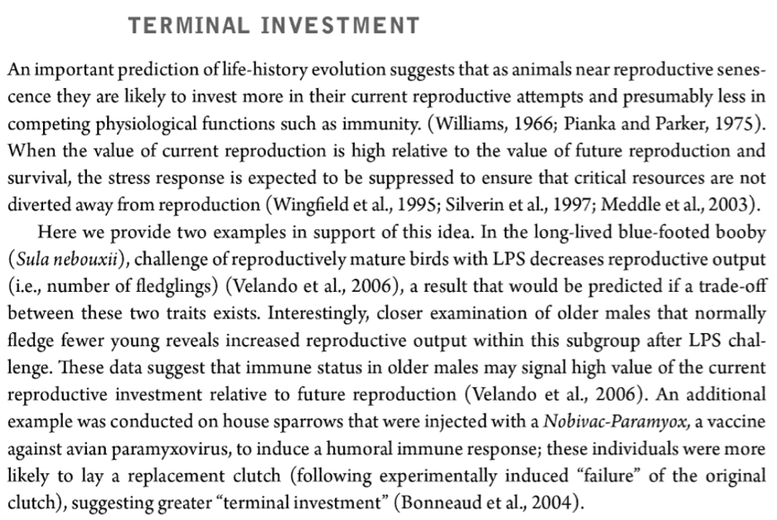

```{r setup, cache = F, echo=FALSE, results = FALSE}
knitr::opts_chunk$set(error = TRUE) #allow some execution errors for demonstration purposes
knitr::opts_chunk$set(eval = TRUE, echo = TRUE, warning = FALSE, collapse = TRUE, comment = "#>")
sessionInfo()
```

```{r prepare, message = FALSE, echo = FALSE, eval = FALSE, warning = FALSE}
install.packages("diagram")
```

```{r load packages, message = FALSE, echo = FALSE, eval = TRUE, warning = FALSE}
library(diagram)
```

# EXERCISES - SEARCHING AND SCREENING PAPERS FOR META-ANALYSIS  

Prepared by Malgorzata (Losia) Lagisz, BEES, UNSW, AU, losialagisz@gmail.com.   

### Purpose of the exercise:   
In this exercise you get some practice and tips on:   
  
 * Formulating the question for a meta-analysis   
 * Deciding on inclusion criteria   
 * Making decision trees   
 * Performing searches for relevant literature   
 * Screening the literature  
 * PRISMA and other documentation  
<br>

  
********************************************************************************  
### Introduction   

Imagine, you woke up in the morning feeling rather sick. You decided to work from home to get some rest a get better more quickly. You dod not feel energetic enough to crunch numbers or write, so you thought you may catch up on scientific reading instead. You pick up the book sitting on top of the "to-read"" pile and open it at a random place. It happens to be **Ecoimmunology** (edited by Gregory Demas, Randy Nelson, Randy Joe Nelson, 2012) and it opens on the following fragment:

```{r TI_book_fragment, echo=FALSE, fig.cap=" ", out.width='50%'}

```

You find it intriguing and start thinking this might be something (a topic) you could do a meta-analysis on.  *(Ok, this is a hypothetical example of coming up with the topic for a meta-analysis, but it sometimes happens - you read or hear some interesting questions and it sparks desire to put some numbers on some pattern...)*   

Let's use this hypothetical topicfor the purpos of the exercise. We hope the topic is quite appealing and quiet easy to understand (we all get sick and most of us reproduce, or at least try to).

In this exercise, we will use a few basic tools to illustrate how to perform the first few steps of meta-analysis: refinig the question, searching and screenig literature (these are the same steps as in Systematic Reviews, so the tools are the same and can be useually described as systematic literature/evidence reviewing tools).  
Note that some R packeages (and many other online/software tools) are available (and more always coming) that can help with some of the tasks during this exercise, but there is no single "perfect" tool for the whole process usable for all disciplines and types of questions (althoght some attempts have been made). We simply do not have enough time to introduce more tools and the main purpose of this exercise is to familiarise you with the basic principles/issues that apply when you use any tools. You can always try alternative tools in your own time.   

**Note:** There will be some **QUESTIONS** to answer and **TASKS** to be performed, as well as **RESOURCES**      
There is no *R* code to be run in this exercise.   
<br>


********************************************************************************
###  Formulating the question for a meta-analysis  

Topic is usually broad and vague area of interest, for a meta-analysis we need a much more concrete question.
Generally, the more focused the question, the easier and quicker it is to perform the meta-analysis, but the answer becomes less general and there might be less evidence available.

**QUESTION 0:**  
What is your initial feeling about the meta-analytical question that can be derived from the text fragment cited above?   

**ANSWER 0:**  
The most general question would be "What is the evidence for terminal investment happening?"    
But that is not a good question, because it is way too general.  

**QUESTION 1:**  
What are at least 2 ways of improving this initial question to make it more amenable for a meta-analysis?

**ANSWER 1:**  
 1. Note that the listed examples involve challenge to immune system - this is becouse experimental manipulation can give clearest answer to whether termnal investment can be happening. So, the more precise  question would be "whether immune challenge can result in terminal investment"
 2. The examples given involve animals (birds), but plants and organisms from other kingdoms can also be used to answer such questions. However, they have quite dfferent immune systems and life histories, so it might be a good idea to restrict the question to animals, or even to a specific animal taxon (birds or insects). Note that in plant research different terminology can be used, e.g. overcompensation (there is a meta-analysis just published in Ecology on overcompensation in response to herbivory: https://www.ncbi.nlm.nih.gov/pubmed/30554427 , and a few older ones).   

These question refinements are leading us gently into deciding which studies to use in a meta-analysis. However, before we move onto inclusion criteria, it is wise to gather more intelligence (Unless you are already an expert on the topic).

**QUESTION 2:**  
What should we do now?    
 a) Check if there already is a good recent meta-analysis on the topic.  
 b) Find and carefully read key reviews on the topic.  
 c) Find and carefully read a few representative empirical papers.  
 d) Further refine the question.  
 e) All of the above.  

**ANSWER 2:**  
e) All of the above.   
Doing some scoping searches and some more reading will help to get to know theoretical background, make predictions and get a feel of what sort of empirical papers are available, and order of magnitude of the number of available papers. These searches can reveal mexisting meta-analyses on the topic, key narrative reviews and empirical papers, all of these will help refining the question and deciding on teh inclusion criteria for meta-analysis. We dont have time to do this all during this exercise, so we just do a quick scoping search for existing meta-analyses to familiarise you with GoogleScholar:

**TASK 1:**  
Are there any meta-analyses (or smilar) on terminal investment in animals?   (you can skip the following few tasks if short of time during the exercise)   
In GoogleScholar (https://scholar.google.com) run:  
*"meta-analytic" OR "meta-analysis" "terminal investment"*   
(you can paste this into search box or use Advanced search; see instructions and other GoogleScholar tips here: https://guides.library.ucsc.edu/c.php?g=745384&p=5361954 and https://scholar.google.com/intl/en/scholar/help.html).   

You should get around 300 results. By skimming first few pages you can see a few meta-analyses on stress, diet, senescence, parasitism etc., but none probably specifically on terminal investment. There are many empirical papers coming up in this search because they mention meta-analysis in their body text or reference list - note that GoogleScholar searches full text by default. Also by default, the returned results are arranged in order of relevance to the search (whatever that means - its a complex algorithm that decides) and a few first pages contain some potentially relevant empirical papers.    

**TASK 2:**   
You can restrict the search to titles only using:  
*allintitle: "meta analytic" OR "meta analysis" "terminal investment"*   
Now there are no matching hits; but there is no option for searching just in titles and abstracts.    

Other things you should know about GoogleScholar - its search interface is rather simplistic and restrictive, it shows only up to 1,000 results for any particular search query, ranking algorithms are obscured, its hard to export the references, the literature coverage may fluctuate (its based on web scraping) and the searches may not be reproducible. Becouse of this it is not really recommended for the main searches in systematic reviews. On the upside, it can be helpful for additional searches and finding grey literature (not published in peer-review journals).  

**RESOURCES:**   
Other software useful for exploratory (scoping) ad additional searches (check them up later, also note that they may have similar disadvantages to these of GoogleScholar):
 * SemanticScholar: https://www.semanticscholar.org/
 * Dimensions: https://www.dimensions.ai/
 * CiteHero: https://citehero.com/

**TASK 3:**   
Run another Google Scholar quick search:  
*"terminal investment" reproduction*   
This time you should get around 1900 records. Note that Goofgle Scholar does so called Automated Query Expansion for terms that are not set to be exact phrases (in quotes) - it uses alternative forms of these terms.  

**TASK 4:**   
Try Google Scholar quick search:   
*"terminal investment" "immune challenge"*  
This time you should get around 400 records. Skim throug the first three pages of the results to get a feel of the diversity of the studies found (e.g. what taxa are present and what they might measure as reproductive investment) and note the wording of their titles.  

**QUESTION 3:**  
In medical sciences, most meta-analyses (and systematic reviews) fit into the PICO (or related) question framework.   

PICO stands for:   
  * P = Population   
  * I = Intervention  
  * C = Comparison/Control group   
  * O = Outcome   

Formulate meta-analytic question "whether immune challenge can result in terminal investment" using PICO terms (actually this fits really well becouse we can use experimental data).   

**ANSWER 3:**   
  * P = Population                = animal species   
  * I = Intervention              = immune challenge   
  * C = Comparison/Control group  = unchallenged group of animals, otherwiese in the same state   
  * O = Outcome                   = reproduction-related traits   
(further restrictions for all of these can ba added here or later at the criteria stage - we will add them later)   

**RESOURCES:**   
An extensive list of alternative systematic review formulation question framweworks here:  https://www.networks.nhs.uk/nhs-networks/nwas-library-and-information-service/documents/alternative-question-structures-for-different-types-of-systematic-review    )


**Note:** you should always be able to justify your question as important, relevant and timely. 
<br>


********************************************************************************
###  Deciding on inclusion criteria   

The basic PICO components are usually not sufficient to perform the effective screening of the papers for inclusion in meta-analysis.
There are additional both technical and biological refinements to be considered for inclusion criteria in our project.
Most importantly, you always need to be able to justify your inclusion criteria!  

**QUESTION 4:**  
Timespan: should we include studies from any year?  

**ANSWER 4:**   
Probably yes, unless you can come up with a reason for not doing so.  

**QUESTION 5:**  
Language: should we include studies published in any language?  

**ANSWER 5:**   
Most meta-analyses only include studies published in English by default. However, if possible it is recommend to include studies also in other languages (usually not many are found, unles you also perform your searches in other languages). 
**Note:** publication statsu can be also used as a criterium - are you happy to include some types of grey literature (e.g. conference proceedings, theses)?

**QUESTION 6:**  
Study type: should we include any type of study?  

**ANSWER 6:**   
Since we investigate a specific intervention, we should restrict study type to experimental (we should explicitly exclude simulation or experimental studies kind of matching our question).  

**QUESTION 7:**  
Taxa: should we include any type of taxa?   
**ANSWER 7:**   
Thats a difficult one. Animal kingdom is vast and diverse, and some species are especially odd (e.g. humans). Does it make sense to include single-cell animals? Does it make sense to include humans? Probably not.
How about multicellular animals, except humans? If many studies ascross multiple taxa exist, we could focus on the most frequently studied taxa or biologically most interesting. Alternatively just vertebrates, except humans? Another thing worth being specific about is that the animals should be wild-type (non-mutant, not disease models) and ideally not subject to any other significant manipulations that could affect their response (e.g. drug treatment; note there is a thin fuzzy line what these manipulations are). There might also be reasons to exclude standard laboratory species (mice, rat, yeast, fruitlfy) or maybe focus just on them? But, for now, we will stick to any multicellular animals, except humans.  

**QUESTION 8:**   
Manipulation type: should we include any immune challenge?   
**ANSWER 8:**   
There are several established types of experimental immune challenge (blood cells (e.g. SRBC), protein (e.g. PHA), dead or live pathogens or parasites), so its worth including these and similar ones. Non-experimental immune challenge (e.g. natural infestation levels)  should not be included. If something odd comes up later it can come under "exclusion criteria", with justification.   

**QUESTION 9:**   
Control gorup: should we accept any type of control group?  
**ANSWER 9:**   
Control group (unmanipulated) should consist of smimilar individuals, as far as reasonable and not be subject to any other maipulations.  

**QUESTION 10:**   
Outcome type: should we accept any reproduction-related measurements and what that means?   
**ANSWER 10:**    
What is reproduction-related trait will depend on the species studied (may require additional reading or relying on the assertions of the authors). Different taxa will have different suites of reproduction related-traits, but these can be grouped into broader categories (e.g. mate attraction includes vocal signals, visual ornaments, pheromone production etc.; reproductive fitness will include number and quality of offspring) and different specific measurments will be available for different taxa and in different studies - this can be quite messy. If we do not have many studies on the topic and very specific question (e.g. "is the number of offspring affected?"") it is ok to be inclusive and later on try to figure out whether some traits are affected more than others.  

**QUESTION 11:**  
Data type: should we accept any type of data for meta-analysis?   
**ANSWER 11:**   
It depends on the effect size we are planning to use. In our project it can be Cohens d (Hedges g) or lnRR, which are typically calcualted from mean, SD or SE and N (sample sizes). However, thay can be also inferred from some of the test statistics, or even proportions, if means and other descriptive statistics are not available. Other considerations include what to do if some data is missing or unclear.   
<br>


********************************************************************************
### Making decision trees   

Good decision trees make screening the literature faster and more reliable.  
Briefly, if the initial (most general) questions, representing screening criteria, are not fulfilled, the study gets excluded and there is no need to evaluate the remaining criteria, so we save some time.  

**QUESTION 12:**  
How many stages there are during literature screening process?   
**ANSWER 12:**   
The screening of literature is usually done in two stages:   
 1. abstract +  title + keywords  
 2. full text + supplementary information  

**QUESTION 13:**  
How many decision trees do we need, and why, for the literature screening process?   
**ANSWER 13:**    
We need two decision trees! (one for each stage).  
This is because abstracts, titles and keywords do not contein enough information to conclusively answer all of the inclusion criteria questions - you should be excluding every paper for which you cannot answer "yes"" to all the questions. Thus this first stage of screening hes to be more tentative, and we would use a more permissive and simpler decision tree. A good tree starts from the questions that are easiest to answer (if we had any year or language restrictions we would put these on the top). Note thet during abstract screening we exclude the records where definete "no" can be inferred from available information, but we allow for some uncertainity for the "yes" answers by allowing "proabably" as an acceptable answer for inclusion, so we can cghheck for more info in the full text.

Example decision tree for abstract screening:  

```{r diagram decision tree abstracts, fig.width=10, fig.height=6, echo=FALSE, message=FALSE}
par(mar=c(1,1,1,1))
openplotmat() #create an empyty plot
elpos <- coordinates (pos = c(2, 2, 2, 2, 2))
fromto <- matrix(ncol = 2, byrow = TRUE, data = c(1,2, 1,3, 3,4, 3,5, 5,6, 5,7, 7,8, 7,9))
nr <- nrow(fromto)
arrpos <- matrix(ncol = 2, nrow = nr)
for (i in 1:nr) (arrpos[i, ] <- straightarrow (to = elpos[fromto[i, 2], ], from = elpos[fromto[i, 1], ], lwd = 2, arr.pos = 0.7, arr.length = 0.4, arr.type = "simple"))

textrect (mid = elpos[1,], radx = 0.15, rady = 0.05, lwd = 1, lab = c("Study on non-human","multicellular animal?"), box.col = "white", shadow.col = "grey", shadow.size = 0, cex = 0.6)

textellipse (mid = elpos[2,], radx = 0.15, rady = 0.05, lwd = 1, lab = "EXCLUDE", box.col = "coral1", shadow.col = "grey", shadow.size = 0, cex = 0.8)

textrect (mid = elpos[3,], radx = 0.15, rady = 0.05, lwd = 1, lab = c("Experimental study?"), box.col = "white", shadow.col = "grey", shadow.size = 0, cex = 0.6)

textellipse (mid = elpos[4,], radx = 0.15, rady = 0.05, lwd = 1, lab = "EXCLUDE", box.col = "coral1", shadow.col = "grey", shadow.size = 0.001, cex = 0.8)

textrect (mid = elpos[5,], radx = 0.15, rady = 0.05, lwd = 1, lab = c("Experimental","immune challenge?"), box.col = "white", shadow.col = "grey", shadow.size = 0, cex = 0.6)

textellipse (mid = elpos[6,], radx = 0.15, rady = 0.05, lwd = 1, lab = "EXCLUDE", box.col = "coral1", shadow.col = "grey", shadow.size = 0, cex = 0.8)

textrect (mid = elpos[7,], radx = 0.15, rady = 0.05, lwd = 1, lab = c("Reproduction-related","traits measured?"), box.col = "white", shadow.col = "grey", shadow.size = 0, cex = 0.6)

textellipse (mid = elpos[8,], radx = 0.15, rady = 0.05, lwd = 1, lab = "EXCLUDE", box.col = "coral1", shadow.col = "grey", shadow.size = 0, cex = 0.8)

textellipse (mid = elpos[9,], radx = 0.15, rady = 0.05, lwd = 1, lab = c("INCLUDE", "for full-text screening"), box.col = "light green", shadow.col = "grey", shadow.size = 0, cex = 0.8)

text(arrpos[1, 1] - 0.1, arrpos[1, 2] + 0.02, "no")
text(arrpos[2, 1] + 0.07, arrpos[2, 2] + 0.03, "yes/probably")
text(arrpos[3, 1] - 0.1, arrpos[3, 2] + 0.02, "no")
text(arrpos[4, 1] + 0.07, arrpos[4, 2] + 0.03, "yes/probably")
text(arrpos[5, 1] - 0.1, arrpos[5, 2] + 0.02, "no")
text(arrpos[6, 1] + 0.07, arrpos[6, 2] + 0.03, "yes/probably")
text(arrpos[7, 1] - 0.1, arrpos[7, 2] + 0.02, "no")
text(arrpos[8, 1] + 0.07, arrpos[8, 2] + 0.03, "yes/probably")
```


**QUESTION 14:**  
Why in the abstract screening decision tree there is no question about the type of data used to express measurements reported in the study?   

**ANSWER 14:**  
Most likely this will not be reported in the abstract, or only the measurments that were found to be significant will be mentioned This question needs to be answered during the full-text screening phase.  

Full-text screening is more strict and we want to have answers to all our inclusion criteraia. In principle we only have "yes" and "no" answers to the screening questions. However, in practice, if a study looks very relevant but some information is ambiguous or missing, you may decide to contact the authors to get some extra information or data. in such case, you can provisionary include such papers and make final decision once you get, or not, the replies.   

Example decision tree for full-text screening:    

```{r diagram decision tree fulltexts, fig.width=10, fig.height=6, echo=FALSE, message=FALSE}
par(mar=c(1,1,1,1))
openplotmat() #create an empyty plot
elpos <- coordinates (pos = c(2, 2, 2, 2, 2, 2))
fromto <- matrix(ncol = 2, byrow = TRUE, data = c(1,2, 1,3, 3,4, 3,5, 5,6, 5,7, 7,8, 7,9, 9,10, 9,11 ))
nr <- nrow(fromto)
arrpos <- matrix(ncol = 2, nrow = nr)
for (i in 1:nr) (arrpos[i, ] <- straightarrow (to = elpos[fromto[i, 2], ], from = elpos[fromto[i, 1], ], lwd = 2, arr.pos = 0.7, arr.length = 0.4, arr.type = "simple"))

textrect (mid = elpos[1,], radx = 0.15, rady = 0.05, lwd = 1, lab = c("Study on non-human","multicellular animal?"), box.col = "white", shadow.col = "grey", shadow.size = 0, cex = 0.6)

textellipse (mid = elpos[2,], radx = 0.15, rady = 0.05, lwd = 1, lab = "EXCLUDE", box.col = "coral1", shadow.col = "grey", shadow.size = 0, cex = 0.8)

textrect (mid = elpos[3,], radx = 0.15, rady = 0.05, lwd = 1, lab = c("Experimental study?"), box.col = "white", shadow.col = "grey", shadow.size = 0, cex = 0.6)

textellipse (mid = elpos[4,], radx = 0.15, rady = 0.05, lwd = 1, lab = "EXCLUDE", box.col = "coral1", shadow.col = "grey", shadow.size = 0.001, cex = 0.8)

textrect (mid = elpos[5,], radx = 0.15, rady = 0.05, lwd = 1, lab = c("Experimental","immune challenge?"), box.col = "white", shadow.col = "grey", shadow.size = 0, cex = 0.6)

textellipse (mid = elpos[6,], radx = 0.15, rady = 0.05, lwd = 1, lab = "EXCLUDE", box.col = "coral1", shadow.col = "grey", shadow.size = 0, cex = 0.8)

textrect (mid = elpos[7,], radx = 0.15, rady = 0.05, lwd = 1, lab = c("Reproduction-related","traits measured?"), box.col = "white", shadow.col = "grey", shadow.size = 0, cex = 0.6)

textellipse (mid = elpos[8,], radx = 0.15, rady = 0.05, lwd = 1, lab = "EXCLUDE", box.col = "coral1", shadow.col = "grey", shadow.size = 0, cex = 0.8)

textrect (mid = elpos[9,], radx = 0.15, rady = 0.05, lwd = 1, lab = c("Reported means with SD (or SE)", "and N (sample sizes) for the treatment", "and control groups or test statistics", "from which effect sizes for the difference","between two groups can be calculated?"), box.col = "white", shadow.col = "grey", shadow.size = 0, cex = 0.6)

textellipse (mid = elpos[10,], radx = 0.15, rady = 0.05, lwd = 1, lab = "EXCLUDE", box.col = "coral1", shadow.col = "grey", shadow.size = 0, cex = 0.8)

textellipse (mid = elpos[11,], radx = 0.15, rady = 0.05, lwd = 1, lab = c("INCLUDE", "for meta-analysis"), box.col = "light green", shadow.col = "grey", shadow.size = 0, cex = 0.8)

text(arrpos[1, 1] - 0.1, arrpos[1, 2] + 0.02, "no")
text(arrpos[2, 1] + 0.05, arrpos[2, 2] + 0.03, "yes")
text(arrpos[3, 1] - 0.1, arrpos[3, 2] + 0.02, "no")
text(arrpos[4, 1] + 0.05, arrpos[4, 2] + 0.03, "yes")
text(arrpos[5, 1] - 0.1, arrpos[5, 2] + 0.02, "no")
text(arrpos[6, 1] + 0.05, arrpos[6, 2] + 0.03, "yes")
text(arrpos[7, 1] - 0.1, arrpos[7, 2] + 0.02, "no")
text(arrpos[8, 1] + 0.05, arrpos[8, 2] + 0.03, "yes")
text(arrpos[9, 1] - 0.1, arrpos[9, 2] + 0.02, "no")
text(arrpos[10, 1] + 0.05, arrpos[10, 2] + 0.03, "yes")
```


**QUESTION 15:**  
What question is missing on the top of the full-text decision tree?   
(Tip: its not about the Language or publication year)   

**ANSWER 15:**    
The question is "Is the full text of this study available for our assessment?"   
It is often not explicitly stated, but without the full text it is impossible to extract all the necessary information about the study and the data. 
It is a good practice to keep this in mind and use as one of your potential inclusion/exclusion critera.   
<br>

     
********************************************************************************
###  Performing searches for relevant literature  

Normally, we attempt to do a fairly comprehensive literature search (a full systematic review). The reason is that we want to have as many relevant data points as possible to increase the power of statistical analyses. The other reason is that we make effort to capture obscure studies that potentially are more likely to report non-significant results, and this way we actively try to reducte publication bias in our data set. Search strategy should include using at least two wide-coverage/interdisciplinary databases (we recommend Scopus and Web of Science), and a few additional sources of literature such as forward and backward reference searching (looking at cited and citing papers), publication lists of the key authors or labs, searching for unpublished studies and datasets (we will not cover these here).   

In this exercise we only do a bit of the core search using 2 cdatabases:
Scopus and Web of Science.

**RESOURCES:** 
Scopus: https://www.scopus.com/   
Web of Science (WoS): http://apps.webofknowledge.com   
**Note:** WoS coverage depends of institutional subscription package purchased, so results of searches can vary among institutions.  

**TASK 5:**   
Using Scopus **Advanced Search** run this search strings:  
 1. *TITLE-ABS-KEY ( "terminal investment"  AND  "immune challenge" )*    
(approx. 14 hits - search terms too restrictive)   
 2. *TITLE-ABS-KEY ( ( "terminal investment"  OR  "reproductive effort" )  AND  ( "immune challeng\*"  OR  "immunochalleng\*" ) )  *
(approx. 25 hits - a bit better, but still too restrictive)   
 3. *TITLE-ABS-KEY ( ( "terminal investment"  OR  "reproductive effort" )  AND  ( "immune challeng\*"  OR  "immunochalleng\*"  OR  "infect\*" ) )  *
(approx. 180 hits - much better number, but we probably now have included many non-experimental studies while still missing relevant ones)    
 4. *( TITLE-ABS-KEY ( ( "terminal investment"  OR  "reproductive effort" )  AND  ( "immune challeng\*"  OR  "immunochalleng\*"  OR  "infect\*" ) )  AND NOT  TITLE-ABS-KEY ( load  OR  human  OR  people ) )* 
(approx. 144 hits - by adding a group of exclusion tems (AND NOT) we probably got rid of some irrelevant ones).  

Ideally, we shoult think and test some more terms for inclusion, after doing some scoping searches, reading reviews and sentinel relevant empirical papers. We stop for now and assume that the string above is our final searxh string. Note that Scopus Advanced Search stores all your searches ans search strings in a neat table at the bottom of the search window - its easy to copy this out and include in the documentation on how you developed your search strategy (same applies to WoS database). The \* symbol stands for wildcart and indicates "any symbols" since these databases do not do Automatic Query Expansion.    

**TASK 6:**    
We can easily translate our final search string from Scopus into Web of Science (WoS) **Advanced Search**. Run this search string:    
*TS = (( ( "terminal investment" OR "reproductive effort" ) AND ( "immune challeng\*"  OR  "immunochalleng\*"  OR  "infect\*"  ) ) NOT ( load OR human OR people ) )*  
(approx. 249 hits - more than from Scopus).   WoS stores your search history and also wich sub-data bases were included in the search: Indexes=SCI-EXPANDED, SSCI, A&HCI, CPCI-S, CPCI-SSH, BKCI-S, BKCI-SSH, ESCI, CCR-EXPANDED, IC Timespan=All years" (you can restrit these in Advanced Search)

Both Scopus and WoS allow exporting the found records (with limitations on the max. number per export, **remember to tick the boxes for exporting abstracts!**) - there are multiple file formats you can use, but .ris and .bib are most commonly used ones  - you will need to figure out which ones work for your reference manager software. The next step would be downloading all found records from your "final" search into reference manager of your choice. Combine the references from two databasesinto a single project/folder and removing duplicates (most reference managers have such function, but it never works perfectly - do a visual check after sorting by titles!) before proceeding to screening stage.  

**Note:** It is also a good time to write up your meta-analysis protocol and preregistering your meta-analysis (e.g. on OSF)!
<br>

********************************************************************************
###  Screening the literature   
 
Theoretically you could do screening in teh database browser or your reference manager, but since it is recommended that 2 people do the screening independently (or at least part of the screening), it is good to use a dedicated tool to manage this process.  

**RESOURCES:** 
Rayyan: https://rayyan.qcri.org/welcome (free, you can use it in the web browser or as a phone app; for more details see: http://libraryguides.mcgill.ca/rayyan/home)  
Abstrackr:  http://abstrackr.cebm.brown.edu/account/login (another free tool)

**Note:* it is possible to deduplication algorythms in these are not very good, so its advisable to deduplicate and check your records in the reference manager beforeuploading to the screening software.    


**TASK 7:**  
We prepared a file (*Scopus10.ris*) with 10 references sampled from the set found using search string (these are sets of references from *( ( "terminal investment"  OR  "reproductive effort" )  AND  ( "immune challeng\*"  OR  "immunochalleng\*" ) )  *) in Scopus (same references came up in the equivalent search in WoS).   

We will use these ten referneces to practice title and abstract screening in Rayyan. Screening can be also done in Abstracker, but we found Rayyan bit more relaible and more user-friendly.   
If you are warking in pairs or small groups, one person should create a new project in Rayyan (see below) and invite another person/people to the project using their email address.  

 1. Open Rayyan (we assume you already created a free account) and log in.    
 2. My Reviews -> New REVIEW...   
 3. Enter project title, e.g. "Terminal Investment"" and description, e.g. "test"."   
 4. Select files -> upload *Scopus10.ris* and press Continue.     
It may take several minutes for larger files and slower connections, but eventually the uploaded references should appear in the left panel unde "Search methods" (you can upload more files with references via "Add new" link). Click on the "Uploaded References [scopus10.ris]" link in this panel to see the references in the right panel. Generally clicking on the links within panels on the left will filter the records in the right panels to include on higlithed sets (filtering, to get rid of the filter click on it again to remove hihlighting).  
In the left panels there are several sub-panels.  
 5. In the "Keywords for include"" you can add (via "Add new" link) folowing terms (or at least a few of these): challenge, challenged, injected, injection, infected, infection, PHA, SRBC, vaccine (these terms will be higlighted green in the titles and abstracts to help them find more easily; Rayyan tries to populate this list by itself - but its algorythm is medical-centered so you should adjust this list for your projects).   
 6. "Keywords for exclude" - " set to: review, reviewed, model, human, people, women, men (these terms will be higlighted red in the titles and abstracts to help them find more easily; Rayyan tries to populate this list by itself - but its algorythm is medical-centered so you should adjust this list for your projects).    
 7. Click on "All reviews" button in the top right corner to go to the project lists, then open your=project again by chosing it from the list. A view with a pie chart (your screening progress) and a few buttons will appear. If you need to invite other prople to do screening in parallel with you, do that by clicking on the "Invite" button. Stick with "Collaborator" selection and enter the email and message (e.g. "help me!"). Opne your project again - you should see your collaborators added with some info on their work so far. Press on "Show" button to see the references view.  
 8. Click on the first review from the top - an abstract and other record info will appear in the bottom panel.  
 9. Using pour abstract screening decision tree decide whether include this paper for the next stage of screening and press "Include" or "Exclude" button accordingly. And do the assessment for the remaining records. As you go you can create and assign new labels to individual records, e.g.: "unsure/check". You could also enter reasons for exclusion, e.g. "human" (we normally dont do this as there are often hundreds or thousands esxcluded records per project at this stage).  
10. Go to "All reviews" and check if othe rpeople finished their screening, if applicable. After that you can lift the "blind" mode, export all the records with decisions into a .csv files. For collaborative screens rayyan will now provide filters to disply all consensus included, consensus excluded and records with conflicting decisions. If you have any "conflicts" have a look again and discuss why you couldnt agree on a given record , come to agreement and make final decision. Export the records with final consensus decisions, for documentation.   

**QUESTION 15:** 
How many papers you excluded? How many conflicts you got if you collaboratively screened (and if so what was cousing these conflicts, can the decision tree be improved?)

**ANSWER 15:**   
We think 4 should have been excluded: Simmons2009 and Clancy 2013 as human studies, Gershman2010 and Gonzales-Tokman 2013 as not likely to have any reprodaction-related measurements.   

**TASK 8:**  
Its time to do the full-text screening for the papers that passed totle and abstract screening. There are some full-text papers that passed the intial screening in the directory - assess Nielsen2012 and Ardia2005 using our full-text screening decision tree.   

**QUESTION 16:**  
What was your decision about Nielsen2012 and Ardia2005 papers?   

**ANSWER 16:**    
Nielsen2012 - include, Ardia2005 - exclude due to the lack of good control group.  
<br>


********************************************************************************
###  PRISMA and other documentation  

It is very important to keep detailed record of the whole searching, screening and data extraction process. Searching and screening are usually represented as some variant of PRISMA diagram.
With our 144 records from Scopus, 249 from Wos (these two databases are our "main search"), and imaginary around 400 records from other searches we might have done if we had more time, we would proabably end up with something like this one:    


```{r diagram decision tree PRISMA, fig.width=10, fig.height=6, echo=FALSE, message=FALSE}
par(mar=c(1,1,1,1))
openplotmat() #create an empyty plot
elpos <- coordinates (pos = c(3, 3, 4, 3, 4, 3, 4, 3, 4, 4))
#text(elpos) #temporary label element positions with numbers

elpos[19,] <- elpos[19,] + c(0.02,0) #shift positions for the "EXCLUDED" element
elpos[26, ] <- elpos[26,] + c(0.02,0) #shift positions for the "EXCLUDED" element

#draw arrows
fromto1 <- matrix(ncol = 2, byrow = TRUE, data = c(1,8, 2,8, 8,15, 15,22, 22,29, 29,33, 3,13, 13,20, 20,27, 27,33, 15,19, 22,26)) #first set of arrows
arrpos1 <- matrix(ncol = 2, nrow = nrow(fromto1)) #set arrow psitions
for (i in 1:nrow(fromto1)) (arrpos1[i, ] <- straightarrow (to = elpos[fromto1[i, 2], ], from = elpos[fromto1[i, 1], ], lwd = 2, arr.pos = 0.8, arr.length = 0.3, arr.type = "simple")) #draw arrows

fromto2 <- matrix(ncol = 2, byrow = TRUE, data = c(13,19, 27,26)) #second set of arrows
arrpos2 <- matrix(ncol = 2, nrow = nrow(fromto2)) #set arrow psitions
for (i in 1:nrow(fromto2)) (arrpos2[i, ] <- straightarrow (to = elpos[fromto2[i, 2], ], from = elpos[fromto2[i, 1], ], lwd = 2, arr.pos = 0.65, arr.length = 0.3, arr.type = "simple")) #draw arrows

#draw rectangles and ellipses
textrect (mid = elpos[1,], radx = 0.15, rady = 0.04, lwd = 1, lab = c("SCOPUS","N = 144"), box.col = "white", shadow.col = "grey", shadow.size = 0, cex = 0.8)

textrect (mid = elpos[2,], radx = 0.15, rady = 0.04, lwd = 1, lab = c("Web of Science", "N = 249"), box.col = "white", shadow.col = "grey", shadow.size = 0, cex = 0.8)

textrect (mid = elpos[3,], radx = 0.15, rady = 0.04, lwd = 1, lab = c("other sources", "N = approx. 400"), box.col = "white", shadow.col = "grey", shadow.size = 0, cex = 0.8)

textrect (mid = elpos[8,], radx = 0.15, rady = 0.04, lwd = 1, lab = c("After duplicates removed", "N = 310"), box.col = "white", shadow.col = "grey", shadow.size = 0, cex = 0.8)

textrect (mid = elpos[15,], radx = 0.15, rady = 0.04, lwd = 1, lab = c("Deduplicated records screened", "N = 310"), box.col = "white", shadow.col = "grey", shadow.size = 0, cex = 0.8)

textrect (mid = elpos[22,], radx = 0.15, rady = 0.04, lwd = 1, lab = c("Full-text screened", "N = 50"), box.col = "white", shadow.col = "grey", shadow.size = 0, cex = 0.8)

textrect (mid = elpos[13,], radx = 0.15, rady = 0.04, lwd = 1, lab = c("Records screened", "N = approx. 400"), box.col = "white", shadow.col = "grey", shadow.size = 0, cex = 0.8)

textrect (mid = elpos[20,], radx = 0.15, rady = 0.04, lwd = 1, lab = c("Dedupicated against main search", "N = 10"), box.col = "white", shadow.col = "grey", shadow.size = 0, cex = 0.8)

textrect (mid = elpos[27,], radx = 0.15, rady = 0.04, lwd = 1, lab = c("Full-text screened", "N = 10"), box.col = "white", shadow.col = "grey", shadow.size = 0, cex = 0.8)

textellipse (mid = elpos[33,], radx = 0.15, rady = 0.05, lwd = 1, lab = c("INCLUDED", "in meta-analysis", "N = 39"), box.col = "light green", shadow.col = "grey", shadow.size = 0, cex = 0.8)

textellipse (mid = elpos[19,] + c(0.05,0), radx = 0.06, rady = 0.02, lwd = 1, lab = "EXCLUDED", box.col = "coral1", shadow.col = "grey", shadow.size = 0, cex = 0.8)

textellipse (mid = elpos[26,]+ c(0.05,0), radx = 0.06, rady = 0.02, lwd = 1, lab = "EXCLUDED", box.col = "coral1", shadow.col = "grey", shadow.size = 0, cex = 0.8)

#put numbers on exclusion arrows
text(elpos[19, 1] - 0.07, elpos[19, 2] + 0.02, "260")
text(elpos[26, 1] - 0.07, elpos[26, 2] + 0.02, "15")
text(elpos[19, 1] + 0.12, elpos[19, 2] + 0.12, "approx.380")
text(elpos[26, 1] + 0.14, elpos[26, 2] + 0.02, "6")
text(elpos[29, 1] + 0.02, elpos[29, 2] + 0.06, "35")
text(elpos[30, 1] + 0, elpos[30, 2] - 0.02, "4")
#text(arrpos[3, 1] - 0.1, arrpos[3, 2] + 0.02, "no")
```
<br>


**QUESTION 17:**   
How many papers in total were excluded during the full-text screening?   

**ANSWER 17:**    
15+6 = 21   

**Note** When you exclude records in the full-text screen keep recore for each indicvidual paper on the main reason for exclusion. Later present this information as a supplementary table for your meta-analyses. (Table of included studies should go in the main text, if possible).    


Can you think of any other good questions for this section?   

